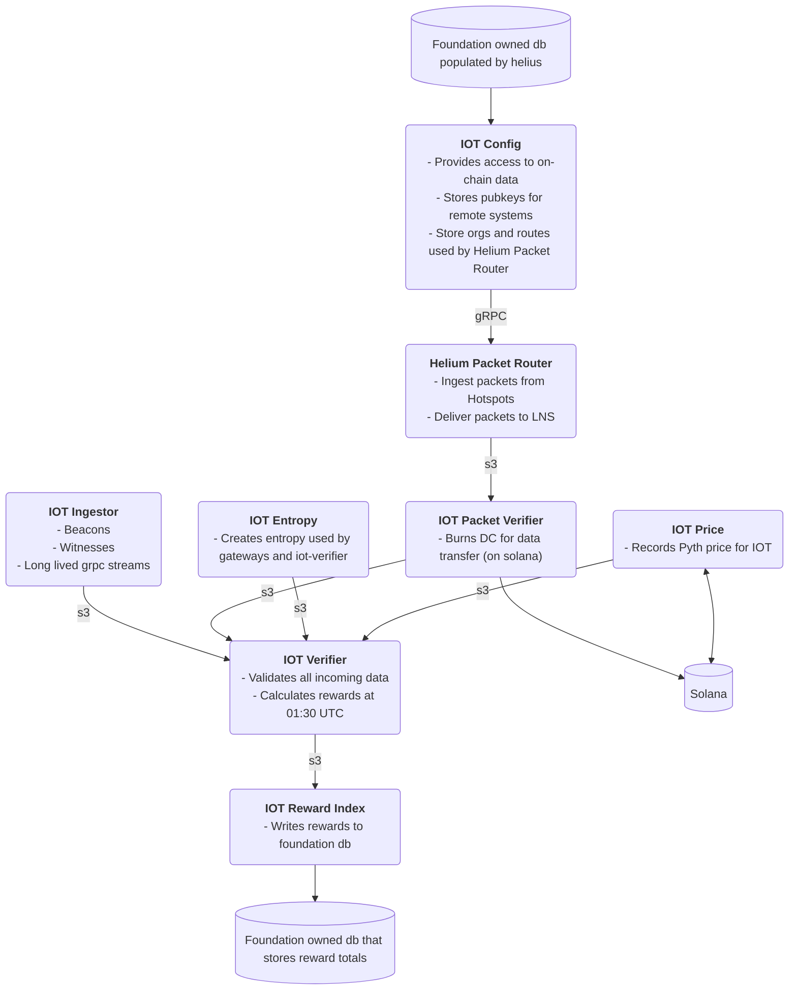

# Helium IoT Oracles [](https://github.com/helium/oracles-iot/actions/workflows/CI.yml)

Oracles for the Helium IoT Network.

> **Note**: This repository was split from the main [helium/oracles](https://github.com/helium/oracles) repository. For Mobile oracles, see [helium/oracles](https://github.com/helium/oracles).

## Architecture



## Components

### IoT Verifier
PoC (Proof of Coverage) Verifier - validates beacon/witness reports, calculates rewards.

### IoT Config
Configuration APIs for IoT subnetwork - provides access to on-chain data.

### IoT Packet Verifier
Packet verification - burns Data Credits for data transfer on Solana.

### Supporting Services
- **Ingest**: PoC ingest server (IoT mode)
- **Price**: Price oracle for IOT token
- **Reward Index**: Writes rewards to foundation database
- **PoC Entropy**: Creates entropy for gateways and verifier

## Shared Libraries

This repository depends on shared infrastructure libraries from the [oracles](https://github.com/helium/oracles) repository via git dependencies:

- `file-store` and `file-store-oracles`: File-based storage abstractions
- `db-store`: Database storage layer
- `task-manager`: Task scheduling and management
- `custom-tracing`: Tracing utilities
- `poc-metrics`: Metrics collection
- `tls-init`: TLS initialization
- `price-tracker`: Price tracking utilities
- `reward-scheduler`: Reward scheduling
- `solana`: Solana blockchain integration
- `denylist`: Denylist management

## Development

### Building

```bash
cargo build --release
```

### Testing

```bash
cargo test --workspace
```

### Local Development with Shared Libraries

If you need to modify shared libraries during local development, you can use path overrides in the root `Cargo.toml`:

```toml
[patch."https://github.com/helium/oracles"]
file-store = { path = "../oracles/file_store" }
db-store = { path = "../oracles/db_store" }
# Add other libraries as needed
```

Remember to remove these patches before committing.

## Deployment

IoT services are built as Debian packages and deployed via the CI/CD pipeline. Packages are uploaded to packagecloud at `helium/oracles-iot`.

## Multi-Mode Applications

Some applications in this repository (ingest, price, reward_index, poc_entropy) contain code for both IoT and Mobile networks. Mobile-specific code will be pruned in future updates.
